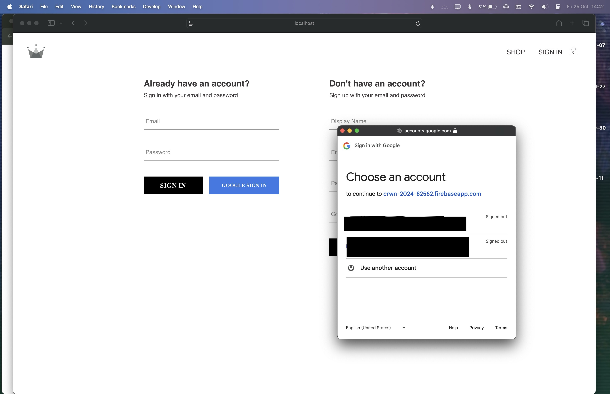

# CRWN Clothing eCommerce

Welcome to **CRWN Clothing** – an eCommerce platform where users can browse by category, add or remove items from the cart, and complete purchases. Built with React, Firebase, Firestore, and Stripe, this project offers a seamless shopping experience with user authentication and data persistence.


## Table of Contents

- [Project Overview](#project-overview)
- [Key Features](#key-features)
- [Technologies Used](#technologies-used)
- [Getting Started](#getting-started)
- [Stripe Setup](#stripe-setup)
- [Testing Payments in Development](#testing-payments-in-development)
- [Contributing](#contributing)
- [License](#license)

## Project Overview

CRWN Clothing is designed to simulate a real-world shopping app, with authentication for added security, category-based browsing, and a cart that persists using Redux Persist and Firestore. Users can authenticate with Firebase, store cart data, and make payments with Stripe.

## Key Features

- **User Authentication**: Firebase authentication, supporting email/password and Google sign-in.
- **Firestore Data Storage**: Categories, products, and user data are stored in Firestore.
- **Redux State Management**: Uses Redux Toolkit and `redux-persist` for managing state and ensuring data persistence.
- **Shopping Cart**: Add, remove, and update items in the cart.
- **Stripe Payment Integration**: Secure payment processing via Stripe.
- **Responsive Design**: Mobile-friendly layout for a smooth shopping experience on all devices.


## Technologies Used

### Frontend

- **React** – Core library for building user interfaces
- **React Router** – Client-side routing for seamless navigation
- **Redux Toolkit** – State management and asynchronous actions
- **Redux Persist** – Persistent state storage in local storage
- **SASS** – Styling preprocessor for efficient styling

### Backend & Database

- **Firebase** – Backend-as-a-service for authentication and hosting
- **Firestore** – Real-time database for storing user and product data

  

### Payment Processing

- **Stripe** – Payment processing API for handling purchases


## Getting Started

To run this project locally, follow these steps:

### Prerequisites

- Node.js and npm installed
- Firebase project configured with Firestore and Authentication

### Installation

1. Clone the repository:
   ```bash
   git clone https://github.com/shay122990/ecom-react-crwn
   ```
2. Navigate into the project directory:
   ```bash
   cd crwn-clothing
   ```
3. Install the dependencies:
   ```bash
   npm install
   ```
4. Create a `.env` file in the root and add your Firebase and Stripe API keys:
   ```env
   REACT_APP_FIREBASE_API_KEY=your_api_key
   REACT_APP_FIREBASE_AUTH_DOMAIN=your_auth_domain
   REACT_APP_FIREBASE_PROJECT_ID=your_project_id
   REACT_APP_FIREBASE_STORAGE_BUCKET=your_storage_bucket
   REACT_APP_FIREBASE_MESSAGING_SENDER_ID=your_messaging_sender_id
   REACT_APP_FIREBASE_APP_ID=your_app_id
   REACT_APP_STRIPE_PUBLIC_KEY=your_stripe_key
   ```

### Running the Project

To run the app in development mode:

```bash
npm start
```

---

## Stripe Setup

To enable Stripe for payments:

1. Create a Stripe account [here](https://stripe.com/).
2. Obtain your API keys from the Stripe dashboard.
3. Add your Stripe public key to the `.env` file:
   ```env
   VITE_STRIPE_PUBLIC_KEY=your-public-key
   ```
4. Use the `@stripe/react-stripe-js` and `@stripe/stripe-js` packages for integrating Stripe in your app.
5. For development purposes, make sure you use default card numbers provided by Stripe (e.g., `4242424242424242`, `04/42`, `424`).

---

## Testing Payments in Development

To test payments locally while using Netlify Functions, follow these steps:

### 1. Run Netlify Functions Locally

#### Install the Netlify CLI:

```bash
npm install -g netlify-cli
```

#### Log in to Netlify:

```bash
netlify login
```

#### Run the App Locally with Netlify:

Navigate to your project folder and run:

```bash
netlify dev
```

This command will:

- Serve your app locally.
- Run your Netlify serverless functions in a local environment.
- Proxy requests to `/.netlify/functions/*`.

You should now be able to use the same API endpoints in your app (e.g., `/.netlify/functions/create-payment-intent`) as you would in production.

---

## Contributing

Feel free to open issues and pull requests to improve this project. Follow the standard GitHub flow for contributions.

## License

Distributed under the MIT License. See `LICENSE` for more information.

---
